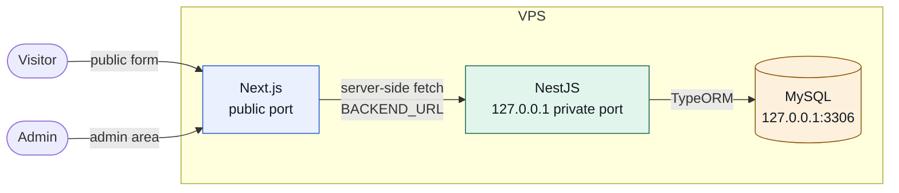
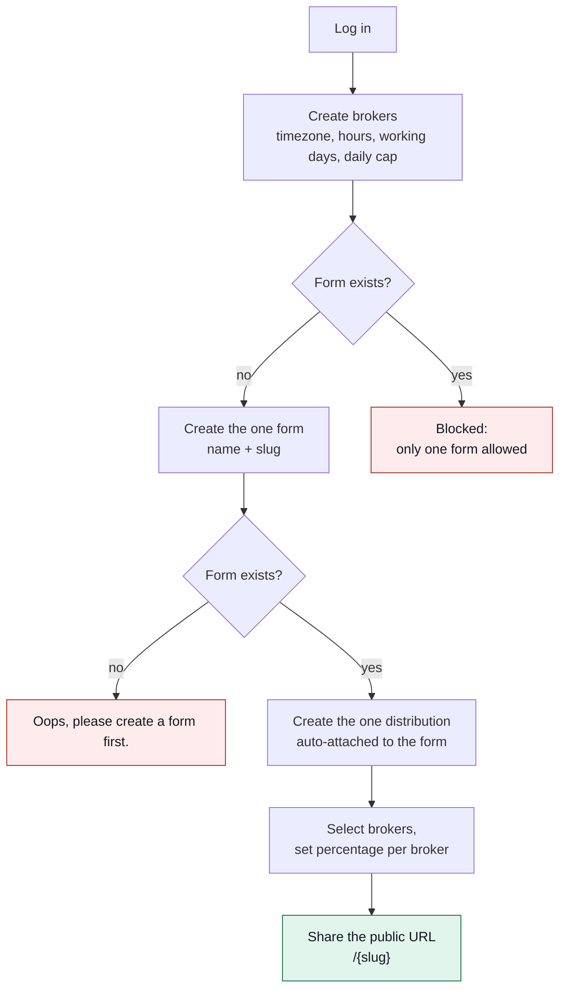
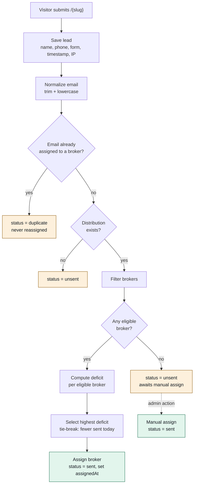
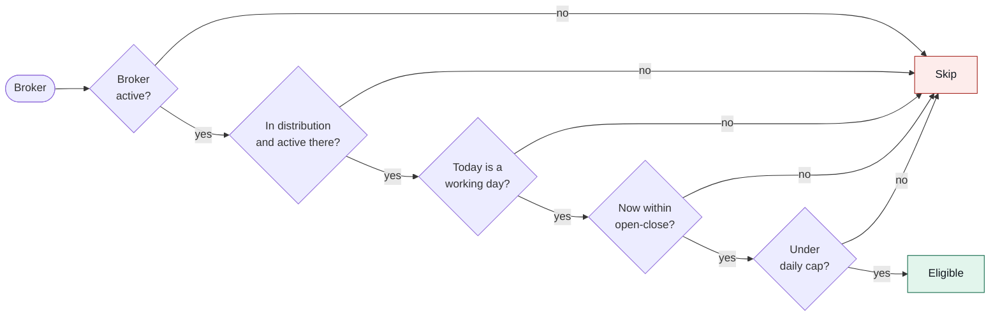
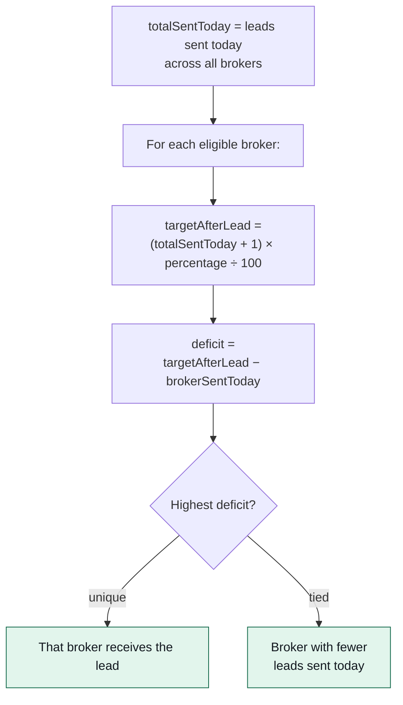
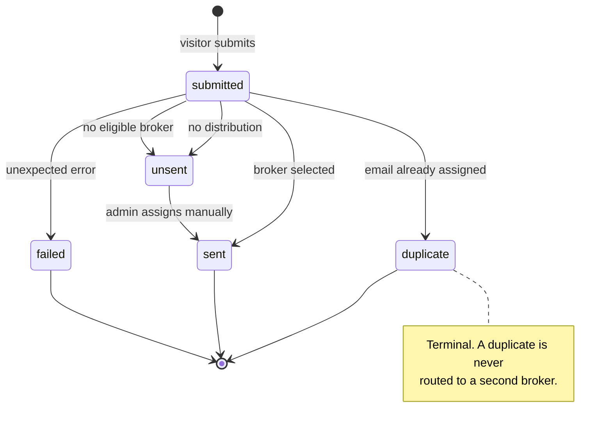
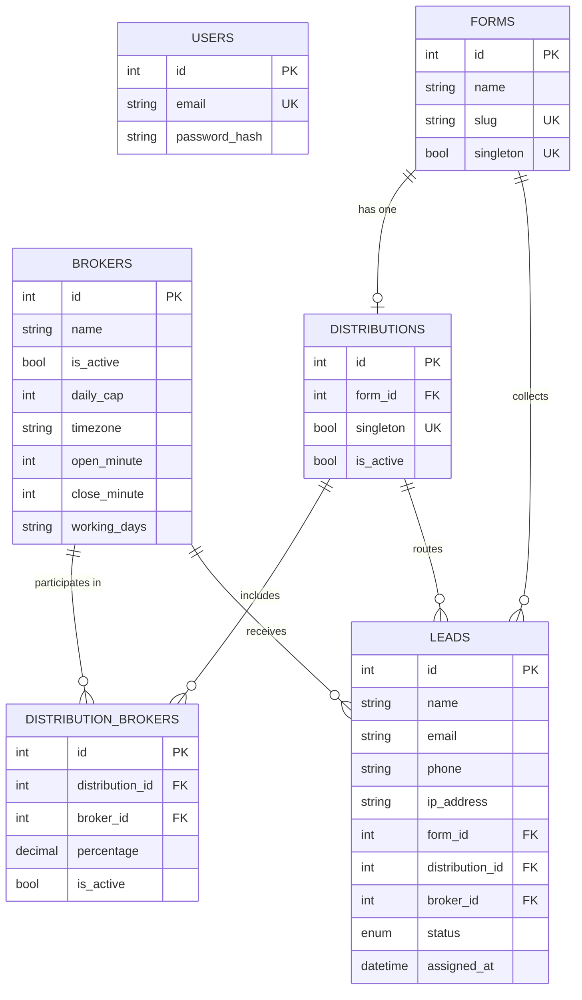
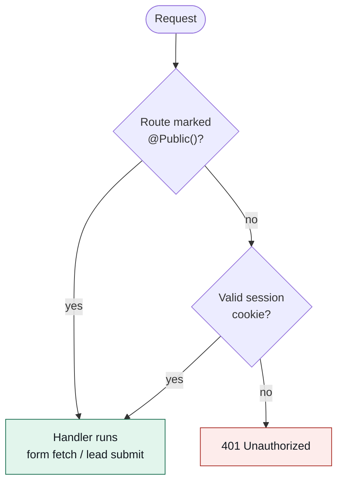

# System flows

Diagrams for the lead distribution platform. Source is Mermaid, which GitHub
renders inline — no build step needed to read this page.

To export SVGs (for a submission PDF or slides):

```bash
npm run docs:diagrams     # writes docs/diagrams/*.svg
```

---

## 1. Deployment topology

Only the frontend port is public. The API listens on loopback, so the private
port is unreachable from the internet even though both processes share a host.



The browser never talks to the API directly. `BACKEND_URL` has no
`NEXT_PUBLIC_` prefix, so it is not inlined into the client bundle.

---

## 2. Admin setup order

The order is enforced, not merely suggested: a distribution cannot exist
without a form.



---

## 3. Lead submission and distribution

The core flow. Every terminal state is a stored lead — nothing is silently
dropped.



Steps from the duplicate check through assignment run in one transaction, so
two simultaneous submissions cannot both read the same `sentToday` counts and
push a broker past its cap.

---

## 4. Broker eligibility

Every check is evaluated in the **broker's own timezone**, never the server's.
A broker failing any check is excluded from the deficit calculation entirely —
not merely ranked lower.



The daily counter resets at midnight in the broker's timezone, so a broker in
`Asia/Manila` rolls over at Manila midnight regardless of where the server is.

---

## 5. Deficit selection



Worked example with `totalSentToday = 10`:

| Broker | Percentage | Sent today | Target after next | Deficit | Result |
|---|---|---|---|---|---|
| A | 50% | 4 | 5.5 | **+1.5** | Receives the lead |
| B | 30% | 3 | 3.3 | +0.3 | Behind, but less so |
| C | 20% | 3 | 2.2 | −0.8 | Already above target |

A negative deficit means the broker is ahead of its share, so it waits.

---

## 6. Lead status transitions



`unsent` is the only non-terminal state — it is the queue the admin works
through on the leads page.

---

## 7. Data model



The `singleton` columns on `forms` and `distributions` carry a UNIQUE index and
are always written as `true`. That is what makes "only one form" and "only one
distribution" a database guarantee rather than a service-layer hope — two
concurrent creates cannot both succeed.

---

## 8. Request authorization



The guard is global and routes opt **out**. Adding an endpoint without thinking
about auth leaves it protected, which is the safe default — the opposite
arrangement leaks a route every time someone forgets a decorator.
